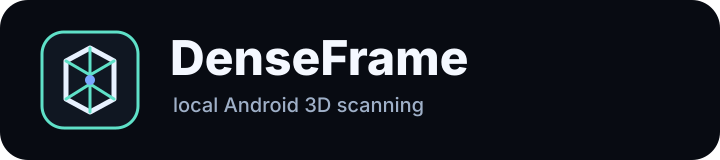
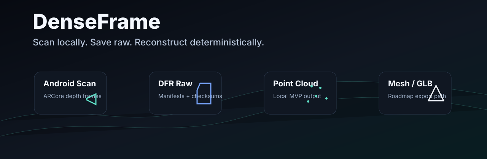
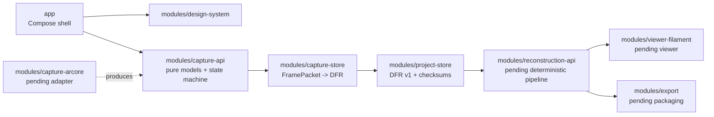

<p align="center">
  
</p>

<p align="center">
  
</p>

<p align="center">
  
  
  
  
  
  
</p>

# DenseFrame

DenseFrame is a local-first Android 3D scanning app for capturing ARCore raw depth into reproducible DFR projects and processing them into point clouds, meshes, and GLB scenes.

Status: early alpha and under active development. The repository currently contains the Android Compose shell, DFR raw project storage, pure capture state machines, and capture-to-storage mapping. The ARCore adapter and reconstruction pipeline are next.

## Product Flow

```text
Scan -> Save Raw -> Process Locally -> View -> Export
```

DenseFrame is built around a simple promise: capture locally, preserve raw data first, process deterministically, and export explicitly.

## MVP Scope

- ARCore raw depth capture.
- DenseFrame Raw Project v1 (`DFR`) folder format.
- Local processing with deterministic parameters.
- Point cloud MVP.
- Viewer and export roadmap for mesh and GLB workflows.

## Non-Goals

- No required cloud processing.
- No hidden network calls.
- No analytics SDKs.
- No proprietary clone of Polycam, KIRI Engine, Scaniverse, or other scanning products.
- No neural or splat mainline until the deterministic pipeline is stable.
- No accounts, feeds, cloud sync, or community sharing in the month-one MVP.

## Architecture



## Modules

| Module | Status | Responsibility |
| --- | --- | --- |
| `app` | Implemented shell | Compose app entry point and local navigation shell. |
| `modules/design-system` | Implemented shell | Theme, typography, reusable UI components. |
| `modules/project-store` | Implemented | DFR v1 models, atomic writes, manifests, checksums, reader, validator. |
| `modules/capture-api` | Implemented | Pure capture contracts, frame packet models, capture session reducer. |
| `modules/capture-store` | Implemented | Deterministic `FramePacket` to DFR frame write bridge. |
| `modules/capture-arcore` | Pending | Future ARCore raw depth adapter. |
| `modules/capture-camerax` | Placeholder | Future CameraX support only if approved. |
| `modules/reconstruction-api` | Placeholder | Deterministic reconstruction contracts and parameters. |
| `modules/viewer-filament` | Placeholder | Future Filament viewer integration. |
| `modules/export` | Placeholder | DFRZ, PLY, GLB, diagnostics packaging. |
| `modules/diagnostics` | Placeholder | Diagnostics reports and failure summaries. |
| `modules/testing-fixtures` | Placeholder | Synthetic fixtures and failure injection helpers. |

## Current Implementation

- Android multi-module Gradle/Kotlin project.
- Polished Compose app shell for gallery, mode select, capture shell, save review, processing, viewer shell, and export placeholder.
- DFR v1 raw project store with crash-safe writes and SHA-256 checksums.
- Capture API state machine with explicit transitions and tests.
- Capture-store mapping from synthetic `FramePacket` objects to DFR frame folders.
- CI workflow configured at `.github/workflows/android-ci.yml`.

Pending:

- ARCore support checks and raw depth adapter.
- Real-device capture on OnePlus 13 primary test target.
- Deterministic point cloud processing.
- Viewer and export MVP.

## Build

Prerequisites:

- JDK 21.
- Android SDK with platform 36 installed.

Useful commands:

```powershell
.\gradlew.bat projects
.\gradlew.bat test --no-daemon
.\gradlew.bat assembleDebug
```

The first run may need dependency access if the local Gradle cache is incomplete.

## Development Workflow

- Branch from `main`.
- Keep commits small and reviewable.
- Run relevant Gradle tests before opening a pull request.
- Update ADRs and docs for architecture, state machine, file-format, capture, reconstruction, or viewer changes.
- Verify official Android, ARCore, CameraX, Filament, glTF, Gradle, Kotlin, or NDK APIs before implementation.
- Do not commit secrets, signing keys, build output, APKs, AABs, raw scans, DFRZ files, PLY files, GLB files, or generated caches.

## Screenshots

Screenshots will be added after the first device capture build.

## Quality Caveats

Scan quality depends on tracking, lighting, motion blur, reflective or transparent surfaces, depth confidence, capture coverage, device support, available storage, and thermal state. DenseFrame should surface these limits clearly instead of implying every scan can produce a clean model.

## Documentation

- [Roadmap](ROADMAP.md)
- [Contributing](CONTRIBUTING.md)
- [Security](SECURITY.md)
- [DFR v1 file format](docs/file-format/dfr-v1.md)
- [Reconstruction pipeline](docs/reconstruction/pipeline.md)
- [Capture to DFR mapping](docs/capture/capture-to-dfr-mapping.md)
- [Month-one risk register](docs/risk/month-one-risk-register.md)

## License

Apache-2.0. See [LICENSE](LICENSE).
